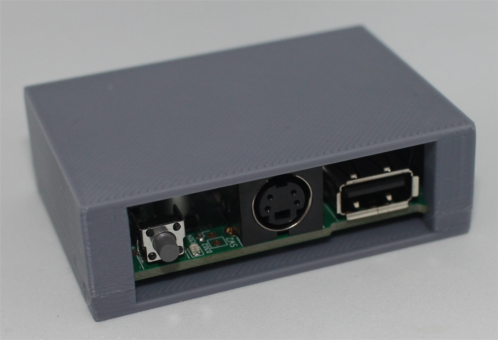

# Background

"Adbuino" has a long history of different people tinkering with it. Just to provide some clarity...

- ORIGINAL PS/2 version - In the beginning - bbraun created the adbuino project and generously open sourced it. The links aren't working anymore, but the original SVN repo was [bbraun's](http://synack.net/svn/adbduino/)
- Difegue PS/2 version - 2020 - Difegue's version of the [adbuino](https://github.com/Difegue/Chaotic-Realm), modified [bbraun's](http://synack.net/svn/adbduino/) version, with some extra code added to alleviate issues with his own PS/2 keyboard.
- akuker USB version - 2022 - akuker converted Difegue's version to use a USB controller and created a PCB design using KiCad.
- [QuokkADB](QuokkADB.md) - 2023 - [Rabbit Hole computing](https://github.com/rabbitholecomputing) created a new PCB based on the RP2040 (instead of Atmel chip). [Morio](https://github.com/morio), ported the code to the dual core RP2040, removed the dependency on the expensive MAX3421E USB controller and updated it to a PlatformIO project. Morio graciously merged their code changes back into [akuker/adbuino](http://github.com/akuker/adbuino)
- [HIDHopper_ADB](https://github.com/TechByAndroda/HIDHopper_ADB) - 2023 - [TechByAndroda](https://github.com/TechByAndroda) forked the repo and made a new PCB that uses a Raspberry Pi Pico (instead of a chip-down RP2040)

Its GPL code. It belongs to the community. Do fun GPL stuff with it. 

# akuker USB Adbuino

This is a fork of Difegue's version of the [adbuino](https://github.com/Difegue/Chaotic-Realm), which was a modified version of [bbraun's](http://synack.net/svn/adbduino/) PS/2 to ADB arduino sketch, with some extra code added to alleviate issues with his own PS/2 keyboard.  For Difegue's original write-up, please read more info [here.](https://tvc-16.science/adbuino-ps2.html).

# QuokkADB

QuokkADB is a modified version of [adbuino](https://github.com/akuker/adbuino). It is targeted to the Rabbit Hole Computing's QuokkADB device. QuokkADB is a Raspberry Pi RP2040 based device that takes in USB inputs from a keyboard and/or mouse and outputs Apple's ADB (Apple Desktop Bus).  Further information can be found in the [QuokkADB.md](QuokkADB.md) file. 

# HIDHopper_ADB

HIDHopper_ADB is a modified (forked) version of adbuino and QuokkADB. It is a Raspberry Pi Pico based hardware device which converts USB keyboard and mouse inputs to the Apple Desktop Bus (ADB) standard.

# Hack-y Alternative
The USB ADBuino is essentially a "value-engineered" version of a bunch of off-the-shelf components. 

  

# How to build and flash an adbuino

Note: This software is intended to be compiled in an Ubuntu Linux environment.

Any dependencies that are configured in the PlatformIO project (such as TinyUSB) will automatically be downloaded. Make sure you are connected to the Internet the first time you build this software.

- Install [Visual Studio Code](https://code.visualstudio.com/)
- Install [Platform IO](https://platformio.org/install)
- Open Visual studio Code and open the directory ./src/adbuino
- Select the PlatformIO icon on the left
- Execute the `Build` project task
- Execute the `Upload` project task to flash your device

# What's this repo for?

The intent of this repository is to add "USB Host" support to the original ADB design. This will allow a USB keyboard and/or mouse to be used to drive an ADB host, as well as PS/2. 

The [BMOW "Wombat"](https://www.bigmessowires.com/usb-wombat/) is a closed-source alternative to adbuino. The [BMOW "Wombat"](https://www.bigmessowires.com/usb-wombat/) is an AWESOME project, but doesn't allow external contributors. 

# References

## Protocol/Software Documentation
- [Apple ADB Manager Documenation](https://developer.apple.com/library/archive/documentation/mac/pdf/Devices/ADB_Manager.pdf)
- [ADB Overview](https://www.lopaciuk.eu/2021/03/26/apple-adb-protocol.html)
- [Microchip Application Note AN591](http://www.t-es-t.hu/download/microchip/an591b.pdf)
- [TMK Documentation](https://github.com/tmk/tmk_keyboard/wiki/Apple-Desktop-Bus)

## Other libraries
- [TinyUSB Library](https://github.com/raspberrypi/tinyusb)
- [MiSTER adb hardware emulation](https://github.com/mist-devel/plus_too/blob/master/adb.v)

## Development resources
- [Running OpenOCD without root](https://forgge.github.io/theCore/guides/running-openocd-without-sudo.html)

## Hardware Links
- [ADB Connector - mouser](https://www.mouser.com/ProductDetail/TE-Connectivity/5749181-1?qs=XlZqES4cpWbRcAMR%2FcJqkQ%3D%3D)
